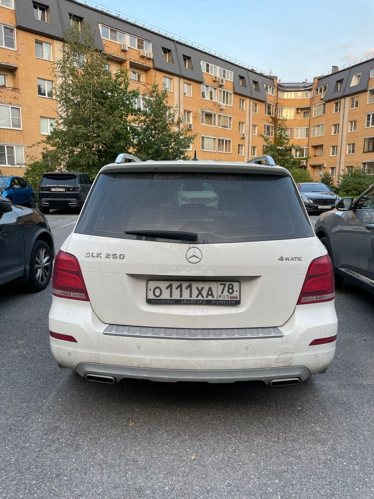
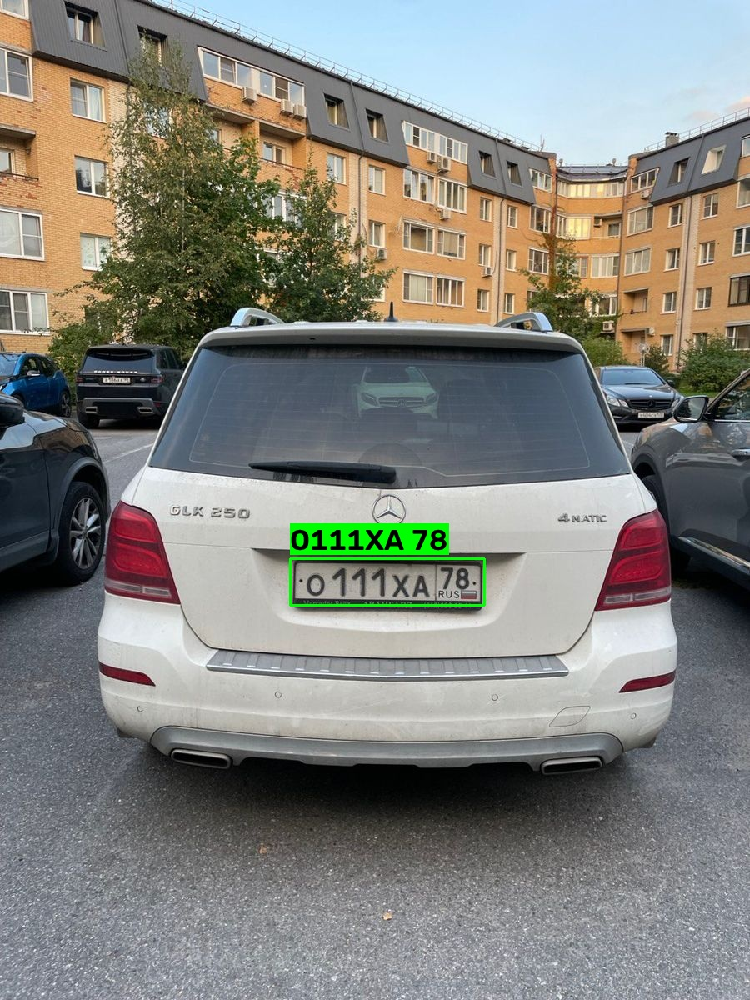
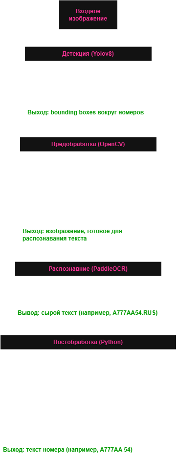

# Car Plate Recognition (Russian)

Система распознавания **российских автомобильных номеров** на edge-устройствах.  
Детекция номеров через **YOLOv8**, распознавание символов через **PaddleOCR** с постобработкой под формат РФ.

---

## Возможности

- **Детекция номера** - YOLOv8, обученная на датасете российских номеров (mAP50 = **0.988**).
- **Распознавание символов** - PaddleOCR с кириллической моделью.
- **Постобработка** - приведение к формату `А123AA 77` с учётом позиций (буква-цифра-буква) и заменой похожих символов (`O`→`0`, `B`→`8`, `T`→`1`).
- **Работа на NPU** - поддержка Qualcomm QCS6490 (Hexagon) через TFLite + QNN Delegate.
- **MQTT-интеграция** - публикация распознанных номеров (в разработке).

---

## Результаты

| Метрика | Значение |
|---------|----------|
| Детекция (mAP50) | 0.988 |
| Детекция (mAP50-95) | 0.802 |
| Точность OCR (100 изображений) | ~80% |
| Скорость детекции (GPU) | ~10 мс |
| Скорость OCR (CPU) | ~50 мс |

 **Пример работы:**

---
## Архитектура

---
## Структура проекта

car-plate-recognition/
├── src/                       
│   ├── detect.py              # YOLO-детекция
│   ├── preprocess.py          # Предобработка (grayscale + CLAHE)
│   ├── ocr_engine.py          # PaddleOCR + постобработка
│   └── pipeline.py            # Связка всех модулей
│
├── scripts/                   # Вспомогательные скрипты
│   ├── train_yolo.py          # Обучение YOLO
│   ├── benchmark.py           # Прогон по датасету
│   └── prepare_benchmark.py   # Подготовка подвыборки
│
├── examples/                  # Примеры
│   ├── input/                 # Входные изображения
│   └── output/                # Результаты
│
├── docs/                      # Документация
│   ├── images/                # Изображения для README
│   └── architecture.md        # Детальное описание
│
├── requirements.txt
├── .gitignore
├── LICENSE
└── README.md

---

## Технологии

| Компонент | Технология |
|-----------|------------|
| Детекция | YOLOv8 (Ultralytics) |
| OCR | PaddleOCR (кириллица) |
| Предобработка | OpenCV (CLAHE, Unsharp Masking) |
| Edge-инференс | TFLite + QNN Delegate (Qualcomm) |
| MQTT | paho-mqtt |
| Платформа | Windows / Linux / Qualcomm QCS6490 |

---

## Датасет

Обучение проводилось на датасете **str2hex/Car_plate_detecting_dataset** (~25 500 изображений российских номеров, разметка в формате YOLO).

- **train**: ~20 000 изображений
- **val**: ~2 500 изображений
- **test**: ~3 000 изображений

Ссылка: https://huggingface.co/datasets/str2hex/Car_plate_detecting_dataset

---

## Roadmap

- [x] Детекция номеров (YOLOv8, mAP50 = 0.988)
- [x] Распознавание символов (PaddleOCR)
- [x] Постобработка под формат РФ
- [ ] MQTT-публикация распознанных номеров
- [ ] Работа на NPU (Qualcomm QCS6490)

---

## Лицензия

Проект распространяется под лицензией **MIT**. Подробности в файле [LICENSE](LICENSE).

---

## Благодарности

- [Ultralytics](https://github.com/ultralytics/ultralytics) — за YOLOv8
- [PaddlePaddle](https://github.com/PaddlePaddle/PaddleOCR) — за PaddleOCR
- [str2hex](https://huggingface.co/str2hex) — за датасет
- [Qualcomm AI Hub](https://aihub.qualcomm.com/) — за инструменты для edge-инференса
